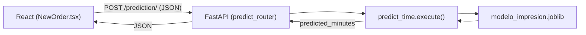

# Sistema de Gestión de Impresiones con Predicción ML (SIPP) | Apartado de experimentacion del modelo 
###### Desarrollador(es): Montañez Fabrizio | Vilchez Joaquim 

Prototipo de un sistema para una imprenta que gestiona pedidos y **estima el tiempo de producción** de cada trabajo mediante un modelo de Machine Learning (RandomForest de scikit-learn).  
  
## Arquitectura  
  
El proyecto está dividido en cuatro componentes independientes:  
  
```  
Prototype/  
├── proyecto-impresiones/   # Frontend (React + Vite + TypeScript + Supabase)  
├── fastapi/                # Backend API que sirve las predicciones del modelo ML  
├── training/               # Script que entrena el modelo y genera el .joblib  
├── db-filler/              # Utilidad para poblar la BD (Turso/libsql) desde un Excel  
├── db.sql                  # Esquema de la base de datos  
└── README.md  
```  
  
Flujo de predicción de punta a punta:  
  

  
1. `training/main.py` entrena un `Pipeline` de scikit-learn y lo guarda como `modelo_impresion.joblib` dentro de `fastapi/prediction/`.  
2. FastAPI carga ese `.joblib` una sola vez al iniciar y expone `POST /prediction/`.  
3. El frontend (`src/lib/mlApi.ts`) mapea las categorías y hace `fetch` al backend; `NewOrder.tsx` muestra el tiempo estimado.  
  
## Requisitos previos  
  
- Node.js 18+ y npm  
- Python 3.11+  
- (Opcional) Docker y Docker Compose  
  
## 1. Frontend — `proyecto-impresiones/`  
  
React + Vite + TypeScript, con Supabase como base de datos. Páginas principales: `Auth`, `Landing`, `Dashboard`, `NewOrder`, `Orders`, `Reports`, `MLModels`.  
  
```bash  
cd proyecto-impresiones  
npm install  
npm run dev  
```  
  
Vite levanta en `http://localhost:5173`.  
  
Variables de entorno (crear un `.env` en `proyecto-impresiones/`):  
  
```  
VITE_SUPABASE_URL=<tu-url-de-supabase>  
VITE_SUPABASE_ANON_KEY=<tu-anon-key>  
VITE_ML_API_URL=http://localhost:8000  
```  
  
Scripts disponibles: `npm run dev`, `npm run build`, `npm run preview`, `npm run lint`, `npm run typecheck`.  
  
## 2. Entrenamiento del modelo — `training/`  
  
Script (no es un servidor) que entrena el `RandomForestRegressor` y genera el `.joblib` en `fastapi/prediction/`. Ejecutar cada vez que quieras regenerar el modelo:  
  
```bash  
cd training  
python -m venv venv && source venv/bin/activate   # opcional  
pip install -r requirements.txt  
python main.py  
```  
  
El modelo usa 5 variables: `TipoTrabajo`, `Cantidad`, `Tamaño`, `Material`, `Color`, y predice `TiempoMinutos`. Genera `fastapi/prediction/modelo_impresion.joblib`.  
  
> Nota: actualmente `main.py` entrena con datos de ejemplo hardcodeados (`valores_ejemplo`). Para producción, carga los datos reales desde la BD/CSV usando **exactamente** las mismas categorías que envía el frontend tras el mapeo de `mlApi.ts`.  
  
## 3. Backend API — `fastapi/`  
  
Sirve las predicciones cargando el `.joblib` generado por `training/`. Endpoint: `POST /prediction/`.  
  
Sin Docker:  
  
```bash  
cd fastapi  
python -m venv venv && source venv/bin/activate  
pip install -r requirements.txt  
uvicorn main:app --reload --port 8000  
```  
  
Con Docker:  
  
```bash  
cd fastapi  
docker compose up --build  
```  
  
Documentación interactiva disponible en `http://localhost:8000/docs`.  
  
Cuerpo esperado por `POST /prediction/` (`PredictRequest`):  
  
```json  
{  
  "job_type": "Documento",  
  "quantity": 100,  
  "size": "A4",  
  "material": "Couché",  
  "isColored": true,  
  "model": "random_forests"  
}  
```  
  
Respuesta: `{ "predicted_minutes": 42.5 }`.  
  
## 4. Poblado de la BD — `db-filler/`  
  
Utilidad que lee un `dataset.xlsx`, inicializa el esquema desde `db.sql` si es necesario, calcula precios y llena la tabla `orders` en una base Turso/libsql.  
  
```bash  
cd db-filler  
pip install -r requirements.txt  
python main.py  
```  
  
Variables de entorno: `TURSO_DATABASE_URL`, `TURSO_AUTH_TOKEN` (por defecto usa `file:local.db` en local).  
  
## Orden recomendado para levantar todo  
  
1. `python main.py` en `training/` → genera `modelo_impresion.joblib` en `fastapi/prediction/`.  
2. Levanta FastAPI (`uvicorn` o `docker compose up`) y verifica `http://localhost:8000/docs`.  
3. `npm run dev` en `proyecto-impresiones/` y prueba el formulario de nuevo pedido.  
  
## Notas importantes  
  
- **CORS:** `fastapi/main.py` solo permite los orígenes `4200/3000/8000`. Como Vite corre en `5173`, añade `http://localhost:5173` a la lista `origins` o el navegador bloqueará el `fetch`.  
- **Unidades:** el modelo devuelve **minutos**; el frontend convierte a horas (`/60`) para mostrar el "Tiempo Estimado".  
- **Categorías:** los vocabularios del frontend (`digital`, `papel_bond`, etc.) se mapean a los del modelo (`Documento`, `Bond`, etc.) en `src/lib/mlApi.ts`. Deben coincidir byte a byte con los usados al entrenar.
